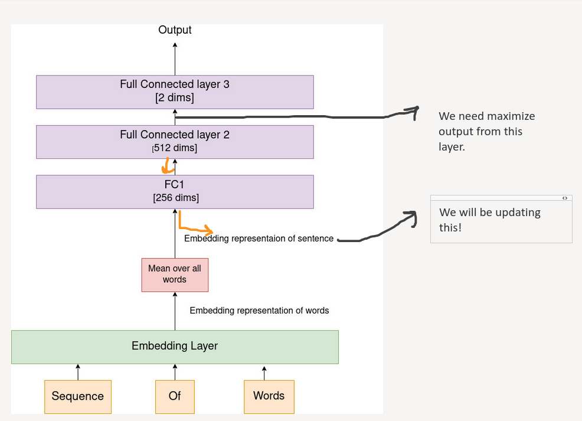
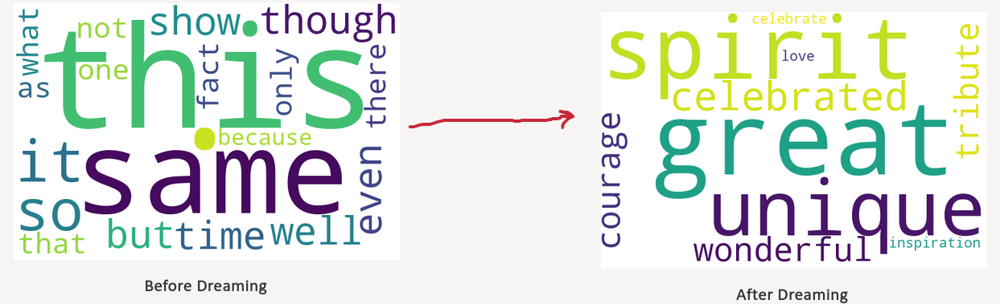
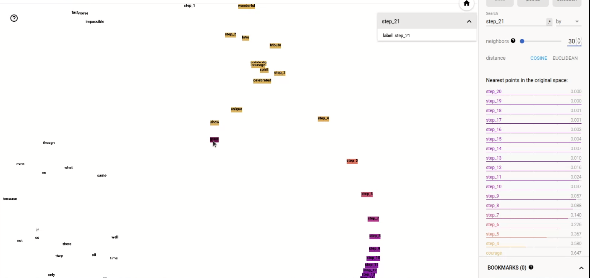

# Dreaming over text

This repo is released along side my blog: [Dreaming over Text]().

## Inspiration

We took inspiration from [deep dream](https://www.tensorflow.org/tutorials/generative/deepdream), where input image is optimized to increase a hidden layer's activation.

## Procedure

1. Convert sentence to tensors.
2. Get the sentence embeddings.
3. Pass through the fc2 layer, and get the fc2 output.
4. Optimize the sentence embeddings to increase fc2 layer output.
5. Repeat step 2 to step 4 with current sentence embeddings for given number of iteration.

## Results

### For Negative Sentence

> I hate this.

Model correctly predicts this as negative.

First we observe what are the words similar (cosine similarity) to the sentence embeddings before and after dreaming.

Initially sentence embedding as more similar to neutral words like "this, it, even, same" but as we increased the magnitude of the fc2 activations, the sentence embedding became similar to words like "bad, nothing, worse" which convey a negative meaning, which is makes sense, as the model predicted it a negative sentence.

### For Positive Sentece

> I love this show.

Model correctly predicts this as positive.

Initially sentence embedding as more similar to neutral words like "this, it, even same" but as we increased the magnitude of the fc2 activations, the sentence embedding became similar to positive words like "great, unique", which is makes sense, as the model predicted it a positive sentence.

## Embedding Exploration

You can try to explore the embedding and how sentence embedding change its location by clicking on [this link.](https://projector.tensorflow.org/?config=https://gist.githubusercontent.com/mythrex/02f9d3b8575910943b89d9964e7fde56/raw/266f8d01fd72737c7ee53072f8e91b2f2bb7e027/Deep%2520dream%2520text%2520embeddings)
